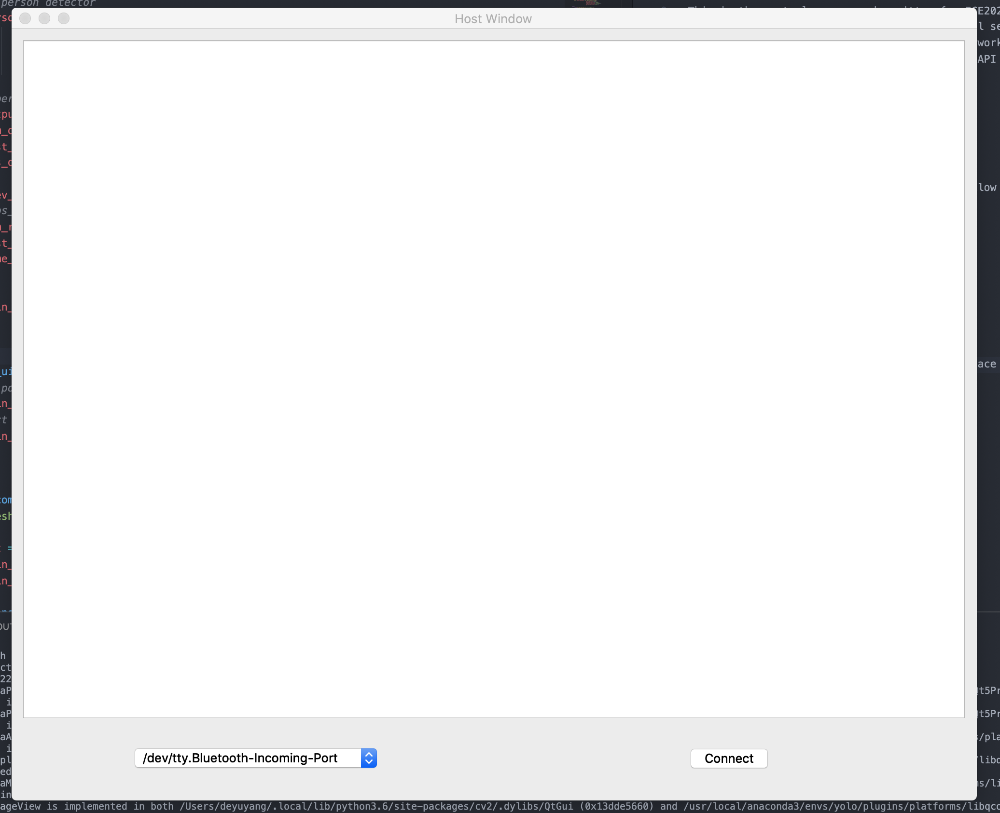

# ReadMe

This is the central server code written for ECE202 project. The program require Pytorch for neural network and PyQt for GUI framework. The central server is tested on MacOS and Win10, should be able to run in Linux platform as well. The neaural network section is port from [yolov3](https://github.com/eriklindernoren/PyTorch-YOLOv3.git) with some API modification to make it work in this project. 

## Instruction on Runing the Code

1. Install required packages use command

        pip install -r requirements.txt

2. Download the neural nework model weight follow the instruction on [yolov3](https://github.com/eriklindernoren/PyTorch-YOLOv3.git) or simply 

        cd nerual_network
        cd weights
        ./download_weights.sh

3. Run the code use command

        python main_host.py

Then you should be able to see the user interface 

Connect the camera module to the computer though UART port, recommand use a USB to TTL adapter. Once connect to the adapter, select the serial port and press connect.
